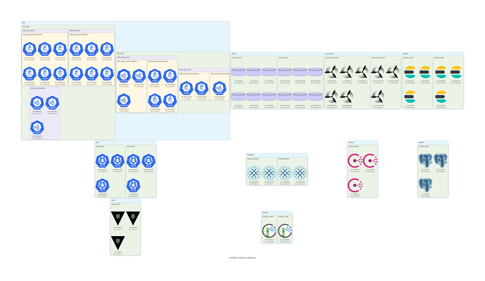

[](https://opensource.org/licenses/BSD-3-Clause)
[](https://tokei.rs/b1/github/mbrav/ansible-inventory-diagram)
[](https://hitsofcode.com/github/mbrav/ansible-inventory-diagram/view?branch=main)

# ansible-inventory-diagram

Script for generating infrastructure graphs from Ansible diagrams files



[Link to image](https://github.com/mbrav/ansible-inventory-diagram/blob/main/ansible_inventory_diagram.png)

## Prerequisites

Before using this script you must install the [Graphviz library](https://graphviz.org/).

### Inventory file preparation

To prepare the JSON necessary to feed the script you must first prepare it using `ansible-inventory` the following way (YAML, INI, and JSON formats can be used):

```bash
ansible-inventory -i inventory/example.yml --list > inventory/example.json
```

**Note:** The script currently is not able to parse inventories tha have many redefinitions of groups. To do so, a more intricate algorithm is necessary. Currently, a very naive one is implemented. To see what kind of inventory structure works well, see [`inventory/example.yml`](inventory/example.yml).

## Usage

Once you have an outputted JSON inventory file you can run the script:

```bash
python3 diagram/main.py
```

## Installation

Clone repo

```bash
git clone https://github.com/mbrav/ansible-inventory-diagram.git
cd ansible-inventory-diagram
```

Install Python libraries

```bash
pip3 install -r requirements.txt 
```

Run script

```bash
python3 diagram/main.py
```
